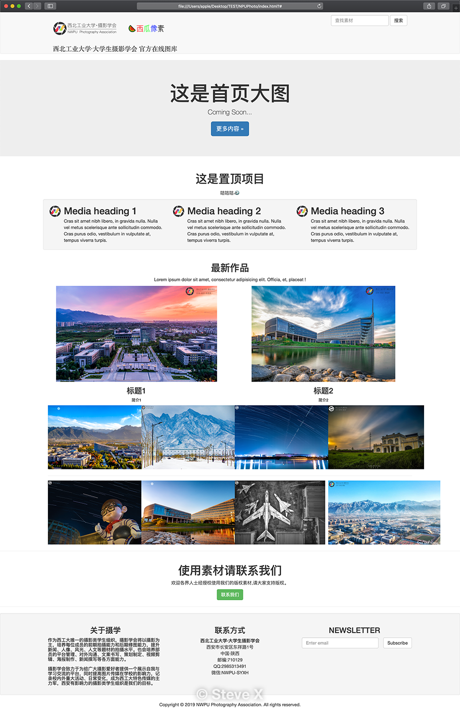

## CHANGELOG
```
CHANGELOG要求:
- 重大版本更新时,总结要点,写入CHANGELOG
- 小修改不需要写,仅在commit时注释即可
- 完成一个完整的页面时添加效果图(半成品不需要截图)
```

---
### 2019-08-14
`by Steve X`

- What's new:
	- 添加了主页部分图文内容
	- 对图片素材上传要求制定了规定[素材要求README.md](images/contents/README.md)
	- 添加了[README.md](README.md)
	- 添加了[CHANGELOG.md](CHANGELOG.md)
##### 效果图


---
### 2019-08-14
`by Alex Chen`

- What's new:
	- 创建了主页
	- 创建了图片信息页
	- 更改了主页logo
	- 对图片信息页做了更改

---
### 2019-08-12
`by Alex Chen`

- What's new:
	- 初始发布

---
`NPUPhoto/CHANGELOG.md`